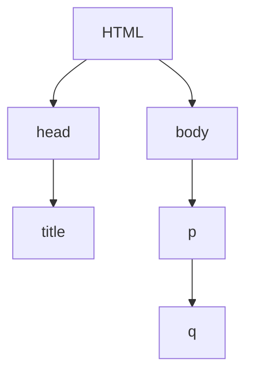

# 前端学习笔记

[TOC]

## 1 前言

### 1.1 学习路线

#### 1.1.1 《Head First HTML 与 CSS》

#### 1.1.2 B 站 HTML、CSS 基础视频教程

> [黑马程序员 pink 老师前端入门教程，零基础必看的 h5(html5)+css3+移动端前端视频教程](https://www.bilibili.com/video/BV14J4114768?p=19&spm_id_from=pageDriver)

HTML 基础(课时:20%)-->CSS3 基础(50%)-->H5C3 提高(10%)-->项目：品优购电商网站(20%)
PC 端网站布局  
最终网站：品优购静态网站  
目的：精通网页布局，为后面学习 JavaScript 打下基础

### 1.2 网页的概念

网页是构成网站的基本元素，它通常由图片、链接、文字、声音、视频等**元素**组成。  
网站是网页的集合，是 HTML 格式的文件，通过浏览器来阅读。

HTML 和 CSS 是用来创建网页的语言

#### 1.2.1 URL(Web 地址)

统一资源定位符(Uniform Resource Locators)可以用来标识 Web 上的任何资源
http://www.starbuzzcoffee.com/index.html  
典型的 URL 由一个协议、一个网站名和资源的一个绝对地址组成

HTTP 超文本传输协议(HyperText Transfer Protocol)，是一个请求和响应协议，用来在 Web 服务器和浏览器之间传送 Web 页面

域名(domain)是一个唯一的名字如：amazon.com 或 starbuzzcoffee.com，用来唯一标识网站

### 1.3 常用浏览器及内核

浏览器是网页显示、运行的平台。常用的浏览器有 IE、火狐(Firefox)、谷歌(Chrome)、Safari 和 Opera 等，称为五大浏览器

浏览器内核(渲染引擎)：负责读取网页内容，整理讯息，计算网页的显示方式并显示页面

1. Trident(IE 内核) 代表:IE、傲游、世界之窗浏览器、Avant、腾讯 TT、猎豹安全浏览器、360 极速浏览器、百度浏览器等,Window10 发布后，E 将其内置浏览器命名为 Edge，Edge 最显著的特点就是新内核 EdgeHTML。
2. Gecko(Firefox 内核) MoillaFireFox(火狐浏览器)采用该内核，Gecko 的特点是代码完全公开
3. webkit(Safari) Safari 是苹果公司开发的浏览器，所用浏览器内核的名称是大名鼎鼎的 WebKit。代表浏览器︰傲游浏览器 3、Apple Safari (Win/Mac/iPhone/iPad)、Symbian 手机浏览器、Android 默认浏览器
4. Chromium/Bink(chrome) Blink 其实是 WebKit 的分支。大部分国产浏览器最新版都采用 Blink 内核。

### 1.4 Web 标准

Web 标准是由 W3C 组织(万维网联盟 World Wide Web Consortium)和其他标准化组织制订的一系列标准的集合  
Web 标准主要包括结构(Structure)、表现(Presentation)和行为(Behavior)三个方面  
Web 标准提出的最佳体验方案：结构、样式、行为相分离

| 标准 | 说明                                                             |
| ---- | ---------------------------------------------------------------- |
| 结构 | 结构用于对网页元素进行整理和分类，主要是 HTML                    |
| 表现 | 表现用于设置网页元素的版式、颜色、大小等外观样式，主要指的是 CSS |
| 行为 | 行为是指网页模型的定义及交互的编写，主要是 JavaScript            |

Web 标准的好处：

1. 让 Web 的发展前景更广阔

2. 内容能被更广泛的设备访问

3. 更容易被搜寻引擎搜索

4. 降低网站流量费用

5. 使网站更易于维护

6. 提高页面浏览速度

### 1.5 开发工具

#### 1.5.1 vs-code

> | 快捷键     | 作用                 |
> | ---------- | -------------------- |
> | Ctrl + N   | 新建文件             |
> | Ctrl + +/- | 放大缩小字体         |
> | !Tab       | 快速生成页面骨架结构 |

常用插件  
中文简体语言包、open in browser、Auto Rename Tag

#### 1.5.2 实用插件

1. snipaste 截图工具

   1. F1 可以设置截图，同时测量大小，设置箭头 书写文字等
   2. F3 在桌面置顶显示
   3. 点击图片，Alt 可以取色(按下 Shift 可以切换取色模式)
   4. 按下 esc 取消图片显示

2. FastStone Capture 屏幕标尺
3. Cutterman 插件切图  
    PS 有很多切图方式：图层切图、切片切图、PS 插件切图  
   右击图层-快速导出为 PNG  
   合并图层(Ctrl+E)-快速导出为 PNG
   利用切片工具手动划出-文件菜单-导出-存储为 web 设备所用格式-选中的切片-存储

#### 1.5.3 所见即所得(WYSIWYG)应用

Microsoft Word Dreamweaver Coda Expression Web
编辑器的完备功能：剪切板(自动插入经常写的 HTML 片段)、在编辑器中直接预览

### 1.6 目录文件夹和根目录

directory：文件夹、目录

目录文件夹：存放了网页需要的相关素材，比如 HTML 文件、图片等  
根目录：打开目录文件夹的第一层就是根目录

为网站选择的文件名和文件夹名中不要使用空格

最好在创建网站的初期组织网站文件，这样就不用在网站升级时修改一大堆的路径了

### 1.7 相对路径与绝对路径

相对路径：以引用文件(源 web 页面)所在位置为参考基础，而建立出的目录路径

| 相对路径分类        | 符号 | 说明                              |
| ------------------- | ---- | --------------------------------- |
| 同一级路径(sibling) |      | 如``        |
| 下一级路径(child)   | /    | 如`` |
| 上一级路径(parent)  | ../  | 如``     |

绝对路径：是指目录下的绝对位置，通常是从盘符开始的路径，从根文件夹到一个文件的路径

### 1.8 Emmet 语法

Emmet 语法的前身是 Zen coding，它使用缩写来提高 HTML/CSS 的编写速度，Vscode 内部已经集成该语法

- 快速生成 HTML 结构语法
  1. 生成标签 直接输入标签名按 tab 键即可
  2. 生成多个相同标签 加* div*4
  3. 父子关系标签 > &nbsp;&nbsp;&nbsp; ul>li
  4. 兄弟关系标签 + &nbsp;&nbsp;&nbsp; div+p
  5. 带类名或 id 名 .demo 或#banner
  6. 若生成的 div 类名是有顺序的，使用自增符号$
  7. 在标签内部写内容用{}表示
- 快速生成 CSS 样式语法
  - 基本采取简写形式
  - 如 w200 按 tab 生成 width:200px;
  - 如 lh26px 按 tab 生成 line-height：26px;
- 快速格式化代码
  - vscode：shift+alt+f
  - 设置保存时自动格式化代码

### 1.9 查阅文档

1. [百度](http://www.baidu.com)
2. [W3school](http://www.w3school.com.cn)
3. [MDN](https://developer.mozilla.org/zh-CN)

#### 1.10 FTP

文件传输协议(File Transfer Protocol)是向服务器传输 web 页面和内容的常用方法

常用命令：

- `dir`： 得到当前目录的文件列表
- `mkdir`： 在服务器上创建一个新目录
- `cd`： 切换到另一个目录
- `pwd`： 显示当前目录
- `put <filename>`: 将指定文件传送到服务器
- `get <filename>`: 从服务器取指定文件，传回自己的计算机

## 2 HTML

HTML 指的是超文本标记语言(Hyper Text Markup Language)，它是用来描述网页的一种语言，HTML 不是一种编程语言，而是一种标记语言(markup language)，标记语言是一套标记标签(markup tag)

元素(element)=开始标记+内容+结束标记，标记会告诉浏览器文本的结构和含义，浏览器会用自己内置的默认样式来表现这个结构。可以用 CSS 指定元素的特性

所有的 HTML 文件都是纯文本文件

浏览器会忽略 HTML 中大多数空白符(制表符、回车、空格)。加入空白符以调高可读性

属性(Attributes)能提供元素的附加信息

### 2.1 HTML 语法规范

HTML 标签是由尖括号包围的关键词,HTML 标签通常是成对出现的，称为双标签；有些特殊的标签是单个标签，称为单标签  
标签关系可分为两类：包含关系和并列关系

属性写法：属性名="属性值"

#### 2.1.1 嵌套关系

画出网页中元素的嵌套(nesting)关系就像画一颗家族树



### 2.2 HTML 基本结构标签

```html
<!DOCTYPE >
<html lang="en">
  <head>
    <meta charset="utf-8" />
    <title>页面标题</title>
  </head>
  <body>
    主体
  </body>
</html>
```

<!doctype>文档类型声明标签，HTML5版本

lang 语言种类： en 定义语言为英语，zh-CN 定义语言为中文

字符集(Character set)是多个字符的集合，以便计算机能够识别和存储各种文字

### 2.3 HTML 常用标签

根据标签的语义，在合适的地方放一个合理的标签，可以让页面结构更清晰

```html
<!-- 标题标签 -->
<h1>一级标题</h1>
<h2>二级标题</h2>
<h3>三级标题</h3>
<h4>四级标题</h4>
<h5>五级标题</h5>
<h6>六级标题</h6>
<!-- 段落和换行标签 文本会在一个段落中根据浏览器窗口大小自动换行、段落和段落之间保有空隙 -->
<p>这是一个段落标签</p>
<!-- 换行标签，和段落不同，段落之间会加入一些垂直的间距 -->
<br />
<!-- 短引用标签 -->
<q>Wherever you go, there you are</q>
<!-- 长引用 -->
<blockquote></blockquote>
```

逻辑区(logical section)

div 是 division 的缩写，表示分割、分区 span 意为跨度、跨距  
`<div>`和`<span>`标签是没有语义的，它们相当于一个容器，把需要共同样式的元素放在一起,创建块级元素和内联字符的逻辑分组,用来布局

### 2.4 文本格式化标签

为文字设置**粗体**、*斜体*或下划线等效果，推荐使用前一组

| 语义   | 标签                           |
| ------ | ------------------------------ |
| 加粗   | `<strong></strong>或者<b></b>` |
| 倾斜   | `<em></em>或者<i></i>`         |
| 删除线 | `<del></del>或者<s></s>`       |
| 下划线 | `<ins></ins>或者<u></u>`       |

### 2.5 图像标签

```html

```

图像标签的其他属性：
|属性|属性值|说明|
|---|---|---|
|src|图片路径|必须属性|
|alt|文本|替换文本，图像不能显示时的文字|
|title|文本|提示文本，鼠标放到图像上显示的文字|
|width|像素|设置图像的宽度|
|height|像素|设置图像的高度|
|border|像素|设置图像的边框粗细|

1. 读取 HTML 页面之后，浏览器会从 Web 服务器获取各个图像并显示
2. 属性之间不分先后顺序，标签名与属性、属性与属性之间均以空格分开
3. 属性采取键值对的格式，即 key="value"的格式，属性="属性值"
4. 图像宽度一般小于 800 像素

### 2.6 链接标签

`<a>`标签用于创建超文本链接，链接到另一个页面 (anchor 的缩写，意为：锚)  
href(hypertext reference 的缩写，超文本引用)

```html
<a href="链接的目标文件" target="目标窗口的弹出方式">文本或图像(label)</a>
```

| 属性   | 作用                                                                    |
| ------ | ----------------------------------------------------------------------- |
| href   | 用于指定连接目标的 url 地址(必须属性)                                   |
| target | 用于指定链接页面的目标窗口，其中\_self 为默认值，\_blank 在新窗口中打开 |
| title  | 所要链接页面的文本描述                                                  |

链接分为

1. 外部链接：URL http://
2. 内部链接： 使用相对链接
3. 空链接：#
4. 下载链接：如果 href 里面是一个文件或者压缩包，会下载这个文件
5. 网页元素链接：各种网页元素，如文本、图像、表格、音频、视频等都可以添加超链接
6. **锚点链接**：可以快速定位到页面中的某个位置
   - href 属性值为#名字，如`<a href="#two">第二集</a>`
   - 找到目标位置的标签，添加 id 属性=名字，如`<h3 id="two">第二集介绍</h3>`

### 2.7 注释标签和特殊字符

`<!-注释语句->` **快捷键 Ctrl + /**

添加注释是为了更好地解释代码的功能，便于开发者理解和阅读代码，程序不会执行注释内容

字符实体(character entity)
| 特殊字符 | 描述 | 字符的代码 |
| -------- | ------ | ---------- |
| | 空格符 | `&nbsp;` |
| < | 小于号 | `&lt;` |
| > | 大于号 | `&gt;` |
| & | 和号 | `&amp;` |
| &copy; | 版权 | `&copy;` |

### 2.8 表格标签

表格主要用于**显示、展示数据**

```html
<table>
  <tr>
    <th>表头</th>
    <td>单元格内的文字</td>
    ...
  </tr>
  ...
</table>
```

| 属性名       | 属性值              | 描述                                 |
| ------------ | ------------------- | ------------------------------------ |
| align        | left、center、right | 表格相对周围元素的对齐方式           |
| border       | 1 或""              | 是否拥有边框                         |
| cellpadding  | 像素值              | 单元边沿与其内容之间的空白，默认 1px |
| cellspacing  | 像素值              | 单元格之间的空白，默认 2px           |
| width/height | 像素值或百分比      | 规定表格的宽度/高度                  |

表格结构标签  
`<thead>`标签 表格的头部区域、`<tbody>`标签 表格的主体区域

合并单元格

1. 跨行合并：rowspan="合并单元格的个数"，最上侧单元格为目标单元格
2. 跨列合并：colspan="合并单元格的个数"，最左侧单元格为目标单元格
3. 删除多余单元格

### 2.9 列表标签

表格用来展示数据，**列表用来布局** 列表的特点是整齐、有序

1. 无序列表：没有顺序之分，并列，
   `<ul>`中只能嵌套`<li>`、`<li>`里面可以放任何标签
   ```html
   <ul>
     <li>列表项1</li>
     <li>列表项2</li>
     ...
   </ul>
   ```
2. 有序列表
   ```html
   <ol>
     <li>列表项1</li>
     <li>列表项2</li>
     ...
   </ol>
   ```
3. **自定义列表**  
   常用于对术语或名词进行解释和描述，定义列表的列表项前没有任何项目符号
   ```html
   <dl>
     <dt>名词1(定义术语)</dt>
     <dd>名词1解释1(定义描述)</dd>
     <dd>名词1解释2</dd>
     ...
   </dl>
   ```

### 2.10 表单标签

表单的主要目的是为了**收集用户信息**，一个完整的表单通常由**表单域、表单控件(也称为表单元素)**和**提示信息**3 个部分构成

**表单域**是一个包含表单元素的区域，`<form>`标签用于定义表单域，以实现用户信息的收集和传递，`<form>`会把它范围内的表单元素信息提交给服务器

常用属性：
|属性|属性值|作用|
|---|---|---|
|action|url 地址|指定接收并处理表单数据的服务器程序的 url 地址|
|method|get/post|设置表单数据的提交方式|
|name|名称|指定表单名称，以区分同一个页面中的多个表单域|

**表单元素**就是允许用户在表单中输入或者选择的内容控件

1. input 输入表单元素

   ```html
   <input type="属性值" />
   ```

   `<input/>`为单标签  
   type 属性设置不同的属性值来指定不同的控件类型
   |type 属性值|描述|
   |---|---|
   |button|可点击按钮(多数情况用于通过 JavaScript 启动脚本)|
   |checkbox|复选框|
   |file|输入字段和"浏览"按钮，供文件上传|
   |hidden|隐藏的输入字段|
   |image|图像形式的提交按钮|
   |password|密码字段，该字段中的字符被掩码|
   |radio|单选按钮|
   |reset|重置按钮，重置按钮会清除表单中的所有数据|
   |submit|提交按钮，提交按钮会把表单数据发送到服务器|
   |text|单行输入字段，可输入文本。默认宽度为 20 个字符|

   其他常用属性
   |属性|属性值|描述|
   |---|---|---|
   |name|由用户自定义|定义 input 元素的名称|
   |value|由用户自定义|规定 input 元素的值|
   |checked|checked|默认选中值(单选按钮和复选框)|
   |maxlength|正整数|规定输入字段中的字符的最大长度|

   1. **name 和 value 是每个表单元素都有的属性值**，主要供后台人员使用
   2. 单选和复选框要有相同的 name 值

   #### `<label>`标签为 input 元素定义标注

   `<label>`标签用于绑定一个表单元素，`<label>`标签的 for 属性与相关元素的 id 属性相同，当单击`<label>`标签内的文本时，浏览器就会自动将焦点(光标)转到或选择对应的表单元素上

   ```html
   <label for="sex">男</label> <input type="radio" name="sex" id="sex" />
   ```

2. select 下拉表单元素
   ```html
   <select>
     <option>选项1</option>
     <option>选项2</option>
     <option selected="selected">默认选定选项3</option>
     ...
   </select>
   ```
3. textarea 文本域表单元素

   ```html
   <textarea rows="3" cols="40"> </textarea>
   ```

### 2.11 HTML5 新特性

向后兼容性(backwards compatibility)

HTML5 针对以前的不足，增加了一些新的标签、新的表单和新的表单属性等

新增的语义化标签

- `<header>`：头部标签
- `<nav>`：导航标签
- `<article>`：内容标签
- `<section>`：定义文档某个区域
- `<aside>`：侧边栏标签
- `<footer>`：尾部标签  
  这种语义化标准主要是针对搜索引擎的；新标签在页面中可以使用多次；IE9 需要转换为块级元素；移动端更喜欢用这些标签

`<section>`比`<article>`更通用，但又不及`<div>`通用，如果只是增加一个元素以便为页面指定样式，可以使用`<div>`，如果要增加一个元素来标记一些内容，指示这是由相关内容构成的一个结构明确的区块，可以使用`<section>`，如果有些内容可以独立于页面上的其余内容进行重用和分发，那就使用`<article>`

新增的多媒体标签

```html
<video
  src=""
  autoplay="autoplay"
  muted="muted"
  controls="controls"
  loop
  poster=""
>
  ` <audio src="" controls></audio>
</video>
```

新增的 input 类型 `type="email" "url" "data" "time" "number" "tel" "search" "color"`

新增的表单属性

required(内容不为空) **placeholder**(提示文本) autofocus(自动聚焦) autocomplete(之前输入过的内容) **multiple**(多选文件提交)

### 2.12 网站 TDK 三大标签 SEO 优化

SEO(Search Engine Optimization)搜索引擎优化，是一种利用搜索引擎的规则提高网站在有关搜索引擎内自然排名的方式  
页面必须有三个标签用来符合 SEO 优化：title description keyword

1. title 网站标题
   title 具有不可替代性，是我们内页的第一个重要标签，是搜索引擎了解网页的入口和对网页主题归属的最佳判断点  
   建议：网站名(产品名)-网站的介绍(尽量不要超过 30 个汉字)  
   例如：

   - 京东(JD.COM)-正品低价、品质保障、配送及时、轻松购物！
   - 小米商城 - Xiaomi 11 Ultra、Redmi K40 Pro、MIX FOLD，小米电视官方网站

2. description 网站说明
   简要说明网站主要是做什么的  
   我们提倡，description 作为网站的总体业务和主题概括，多采用"我们是..."、"我们提供..."、"xxx 网作为..."、"电话：010..."之类的语句  
   例如：

   ```css
   <meta name="description"
          content="京东JD.COM-专业的综合网上购物商城，为您提供正品低价的购物选择、优质便捷的服务体验。商品来自全球数十万品牌商家，囊括家电、手机、电脑、服装、居家、母婴、美妆、个护、食品、生鲜等丰富品类，满足各种购物需求。"/>
    <meta name="Keywords" content="网上购物,网上商城,家电,手机,电脑,服装,居家,母婴,美妆,个护,食品,生鲜,京东"/>
   ```

3. keywords 关键字  
   keywords 是页面关键词，是搜索引擎的关注点之一  
   keywords 最好限制为 6~8 个关键词，关键词之间用英文逗号隔开，采用关键词 1,关键词 2 的形式

   logo SEO 优化

   1. logo 里放 h1 标签，目的是为了提权，告诉搜索引擎，这个地方很重要
   2. h1 里面再放一个链接，可以返回首页的，把 logo 的背景图片给链接即可
   3. 为了搜索引擎收录我们，我们链接里面要放文字(网站名称)，但是文字不要显示出来。

   - 方法 1：text-indent 移到盒子外面(text-indent:-9999px)，然后 overflow:hidden，淘宝做法
   - 方法 2：直接给 font-size:0;就看不到文字了，京东做法

   4. 最后给链接一个 title 属性，这样鼠标放到 logo 上就可以看到提示文字了

## 3 CSS

CSS 是层叠样式表(Cascading Style Sheets)的简称,也称为 CSS 样式表或级联样式表，CSS 也是一种标记语言(markup language)，主要用来美化网页，布局页面

### 3.1 CSS 特性

#### 3.1.1 CSS 语法规范

- 两个主要部分：选择器(selector)以及一条或多条声明
- 属性和属性值以"键值对"的形式出现
- 属性和属性值之间用":"分开
- 多个键值对之间用";"分开

```css
<style>
  选择器 {样式}
  p {
    color: red;
    font-size: 12px;  /*文字大小为12像素*/
  }
</style>
```

#### 3.1.2 代码风格及书写顺序

1.  CSS 代码风格

    - 样式格式
      - 紧凑格式
      - **展开格式**
    - 样式大小写
      选择器，属性名，属性值全部使用小写
    - 空格规范
      - 属性值前面，冒号后面，保留一个空格
      - 选择器后面，{}前面保留一个空格

2.  CSS 属性书写顺序

    1. 布局定位属性：display/position/float/clear/visibility/overflow(建议 display 第一个写 关系到模式)
    2. 自身属性：width/height/background/margin/border/padding
    3. 文本属性：color/font/text-decoration/text-align/vertical-align/white-space/break-word
    4. 其他属性(CSS3)：content/cursor/border-radius/box-shadow/text-shadow/background:linear-gradient...

#### 3.1.3 引入方式及媒体查询

引入方式

- 内部样式表-在 HTML 页面内部，单独写到`<style>`标签中
- 行内样式表-在元素内部的 style 属性中设置，适合于修改简单样式
- 外部样式表-样式单独写到 CSS 文件中，使用`<link>`标签引用

媒体查询

```html
<link
  href="lounge-mobile.css"
  rel="stylesheet"
  media="screen and (max-device-width: 480px)"
  orientation="landscape"
/>
```

```css
@media screen and (min-device-width: 481px) {
  #guarantee {
    margin-right: 250px;
  }
}
```

#### 3.1.4 CSS 三大特性

层叠性、继承性、优先级

- 层叠性原则：

  - 样式冲突，遵循就近原则，执行最下面的样式
  - 样式不冲突，不会层叠

- 继承性(inheritance)：

  - 恰当的使用继承可以简化代码，降低 CSS 样式的复杂性
  - 子元素可以继承父元素的样式(text-, font-, line- 这些元素的开头可以继承，以及 color 属性)
  - 行高可以跟单位也可不跟单位

- 优先级：
  - 选择器相同，则执行层叠性
  - 选择器不同，则根据选择器权重进行
    |选择器|选择器权重|
    |--|--|
    |继承或者 \*|0,0,0,0|
    |元素选择器|0,0,0,1|
    |类选择器，伪类选择器|0,0,1,0|
    |ID 选择器|0,1,0,0|
    |行内样式 style=""|1,0,0,0|
    |！important|无穷大|

### 3.2 CSS 选择器

#### 3.2.1 CSS 基础选择器

基础选择器是由单个选择器组成的，包括：标签选择器、类选择器、id 选择器和通配符选择器

```css
/* 类选择器 */
.类名 {
  color: red;
}
/* id选择器 */
#id名 {
  color: red;
}
/* 通配符选择器 选取页面中的所有元素 */
* {
  color: red;
}
```

> **多类名用空格分开，把标签元素相同的样式(共同部分)放到一个类里面，  
> 这些标签都可以调用这个公共的类，然后再调用自己独有的类**

#### 3.2.2 CSS 复合选择器

复合选择器是建立在基础选择器之上，对基础选择器进行组合形成的  
常用的复合选择器有：后代选择器、子选择器、并集选择器、伪类选择器等等

1. 后代选择器
   后代选择器又称包含选择器，可以选择父元素里面的子元素

   - 元素 1 和元素 2 中间用空格隔开
   - 元素 1 是父级，元素 2 是子级，最终选择的是元素 2
   - 元素 2 可以是儿子，也可以是孙子，是后代就行
   - 元素 1 和元素 2 可以是任意基础选择器

   ```css
   元素1 元素2 { 样式声明 }
   ul li {样式声明}
   ```

2. 子元素选择器
   子选择器只选择某元素的最近一级子元素

   ```css
   元素1>元素2 { 样式声明 }
   ul>li {样式声明}
   ```

3. 并集选择器
   并集选择器可以选择多组标签，同时为他们定义相同的样式。通常用于集体声明

   ```css
   /* 约定的语法规范，并集选择器竖着写 */
   元素1, 元素2 { 样式声明 }
   div,
   p {样式声明}
   ```

4. 伪类选择器(pseudo-classses)
   伪类选择器用于向某些选择器添加特殊效果

   ```css
   a:link    /* 未被访问的链接 */
   a:visited /* 已被访问的链接 */
   a:hover   /* 鼠标悬停在链接上时 */
    /* :focus 伪类选择器用于Tab选取获得焦点的链接/表单元素 */
   input:focus {
     background-color: yellow;
   }
   a: active; /* 鼠标按下链接时 */
   /* 确保链接伪类生效，按照 LVHA 的顺序声明：:link -> :visited -> :hover -> focus -> :active */
   ```

### 3.3 CSS 字体、文本及背景属性

#### 3.3.1 CSS 字体属性

```css
body {
  /* 字体系列serif,sans-serif,monospace,cursive,fantasy，字体之间用 ',' 隔开 */
  font-family: "Microsoft YaHei", Arial, sans-serif;
  /* 字体大小px(像素)，字母的高度 */
  font-size: 16px;
  /* 字体粗细，700为bold(粗体)，400为normal */
  font-weight: 700;
  /* 文字样式 */
  font-style: italic;
}

p {
  /* 简写形式 */
  /* font: font-style font-variant font-weight font-size/line-height font-family */
  font: italic 700 16px "Microsoft yahei";
}
```

> Unicode 编码字体：  
> 把中文字体的名称用相应的 Unicode 编码来代替，这样就可以有效的避免浏览器解释 CSS 代码的时候出现乱码的问题  
> 比如：黑体 \9ED1\4F53 宋体 \5B8B\4F53 微软雅黑 \5FAE\8F6F\96C5\9ED1

#### 3.3.2 CSS 文本属性

```css
div {
  /* 文本颜色 */
  color: red;
  /* 文本对齐方式 */
  text-align: center;
  /* 装饰文本，下划线(underline)、删除线(line-through)、上划线(overline) */
  text-decoration: none;
  /* 文本首行缩进，em是一个相对于单位，当前元素(font-size)的1个文字大小 */
  text-indent: 2em;
  /* 行间距；em 父元素字体大小的倍数；直接数字，基于各个元素本身字体大小的倍数 */
  line-height: 26px;
}
```

text-align:center 会对块元素中所有内联内容对齐(该属性只能在块元素上设置)可继承
文字行高等于盒子高度 实现垂直居中  
行高=文字高度+上空隙+下空隙

#### 3.3.3 CSS 背景

背景属性可以设置背景颜色、背景图片、背景平铺、背景图片位置、背景图片固定等。

```css
background-color: transparent; /*默认值：透明*/
background-image: url();
/* 默认情况：平铺 repeat*/
background-repeat: no-repeat;
background-repeat: repeat-x;
background-position: x y;
/* 视差滚动 */
background-attachment: scroll | fixed;
/* 简写 */
background: pink url(images/pink.png) no-repeat fixed center;
```

背景属性可以合并简写在同一个属性 background 中，没有特定的书写顺序，一般约定为  
background: 背景颜色 背景图片地址 背景平铺 背景图像滚动 背景图片位置;

- 半透明颜色 rgba(0, 0, 0, 0.3) 最后一个参数是 alpha 透明度，取值范围在 0~1 之间

元素的背景图像常见于 logo 或者一些装饰性的小图片或者是超大的背景图片，优点是**非常便于控制位置**(精灵图的运用)
通过 background-position 属性可以改变图片在背景中的位置，参数代表的意思是：x 坐标和 y 坐标，可以使用方位名词或精确单位
|参数值|说明|
|--|--|
|length|百分数、由浮点数字和单位标识符组成的长度值|
|position|top、center、bottom、left、center、right 方位名词|

- 如果指定方位名词，与顺序无关
- 如果只指定一个方位名词，另一个值省略，则第二个值默认居中对齐
- 如果参数是精确单位，第一个是 x 坐标，第二个是 y 坐标
- 如果只指定一个数值，是 x 坐标，另一个默认垂直居中
- 如果两个值是精确单位和方位名称混合使用，第一个值是 x 坐标，第二个是 y 坐标

### 3.4 CSS 元素显示模式

#### 3.4.1 块元素与内联元素

1. 元素的显示模式就是元素(标签)以什么方式进行显示，HTML 元素一般分为块元素和行内元素两种类型

   - 块元素

     - 独占一行(好像前后各有一个换行)
     - 高度、宽度、内外边距都可控制
     - **宽度默认是容器(父级宽度)的 100%**
     - 是一个容器及盒子，里面可以放行内或者块级元素
       > **文字类元素内不能使用块级元素**(`<p>\<h1>`-`<h6>`)

   - 行内元素(内联元素)

     - 相邻行内元素在一行上，一行可以显示多个(行内)
     - **高度、宽度设置无效**
     - **默认宽度是它本身内容的宽度**
     - 行内元素只能容纳文本或者其他行内元素

     > 链接里不能再放链接，链接`<a>`里可以放块级元素，但是给`<a>`转换一下块级模式最安全

   - 行内块元素 同时具有块元素和行内元素的特点
     - 和相邻行内元素(行内块)在一行上，**但是它们之间会有空白缝隙**。一行可以显示多个(行内元素特点)
     - 默认宽度是它本身内容的宽度(行内元素特点)
     - 高度、行高、内外边距都可以控制(块元素特点)
     - `、<input/>、<td>`

2. 元素显示模式转换
   - **行内元素转块元素 display: block;**
     > 比如想要增加链接`<a>`的触发范围
   - 块元素转行内元素 display: inline;
   - **转换为行内块 display: inline-block;**

#### 3.4.2 标准流

浏览器在页面上摆放 HTML 元素的方法

- 块级元素独占一行，从上向下顺序排列
  - 常用元素：div、hr、p、form、table
- 行内元素在水平方向上相互挨着，从左上方流向右下方，**碰到父元素边缘则自动换行**
  - 常用元素：span、a、i、em 等

### 3.5 盒子模型

#### 3.5.1 概述

CSS 使用盒模型来控制元素如何显示

网页布局过程：

1. 准备好相关的网页元素，网页元素基本都是盒子 Box
2. 利用 CSS 设置好盒子样式，然后摆放到相应的位置
3. 往盒子里面装内容

盒子模型(Box Model)组成

- content 内容 (包含元素的内容)
- padding 内边距 (在内容区周围创建可见的空间)
  ```css
  padding: 5px 10px 20px;
  /*上5px，左右10px，下20px*/
  ```
  > 如果盒子本身没有指定 width/height 属性，则此时 padding 不会撑开盒子大小
- border 边框
- (边框包围内边距和内容，提供了从视觉上分离内容的一种手段)
  ```css
  border-width||border-style||border-color
  border: 1px solid red;
  /*相邻边框合并在一起*/
  border-collapse:collapse;
  ```
- margin 外边距  
   即盒子和盒子之间的距离,外边距典型应用-  
   块级盒子水平居中：

  - 盒子必须指定宽度(width 为元素内容区的宽度)
  - 盒子左右外边距设置为 auto
    一个块元素的默认宽度是"auto"，它会延伸占满可用的空间(考虑到内边距，边框和外边距之后)

可以设置内联元素的宽度、外边距、内边距及边框，上下内外边距会与其他内联元素重叠

整个盒子的宽度 = 内容区宽度 + 左右内边距 + 左右外边距 + 边框宽度

CSS3 中可以通过 box-sizing 来指定盒模型宽度，有 2 个值：即可指定为 content-box\border-box，这样我们计算盒子大小的方式就发生了改变

1. box-sizing: content-box 盒子大小为 width + padding + border(默认)
2. box-sizing: border-box 盒子大小为 width

#### 3.5.1 嵌套块元素垂直外边距的塌陷

只要两个垂直外边距碰到一起，它们就会折叠，不论是上下还是嵌套

对于两个**嵌套关系的块元素**，父元素有**上外边距**同时子元素也有上外边距，此时父元素会**塌陷**较大的外边距值
解决方案

- 为父元素定义上边框
- 为父元素定义上内边距
- 为父元素添加 overflow:hidden

#### 3.5.2 清除默认内外边距

网页元素很多都带有默认的内外边距，而且不同浏览器默认的也不一致，因此**在布局前，首先要清除网页元素的内外边距**

```css
/* css的第一行代码 */
* {
  margin: 0;
  padding: 0;
}
```

> 行内元素为了照顾兼容性，尽量只设置左右内外边距，不要设置上下内外边距，除非转换为块级和行内块元素

#### 3.5.3 圆角边框 盒子阴影 文字阴影

```css
/* 设置元素的外边框圆角，圆角矩形设置为高度的一半 */
border-radius: 50%
/* blur 模糊距离；spread 阴影尺寸 */
box-shadow: h-shadow v-shadow blur spread color inset;
text-shadow: h-shadow v-shadow blur color;
```

### 3.6 CSS 布局

传统网页布局的三种方式

- 普通流(标准流)
- 浮动
- 定位
  多个块级元素纵向排列找标准流，多个块级元素横向排列找浮动

- 流体布局(liquid layouts)
  扩展填满整个浏览器，充分利用屏幕空间
- 冻结布局(frozen layouts)
  锁定元素，内容宽度是固定的，外边距随浏览器窗口扩展或收缩
  凝胶(Jello)设计会锁定页面中内容区的宽度，不过会将它在浏览器中居中

#### 3.6.1 CSS 浮动

浮动元素必须有宽度

float 属性用于创建浮动框，将其移动到一边，直到左边缘或右边缘触及包含块或另一个浮动框的边缘

```css
选择器 {
  float: left right none;
}
```

- 浮动元素会脱离标准流(**脱标**，不再保留原来的位置)
- 浮动的元素会一行内显示并且元素**顶部对齐**
- 浮动的元素会具有行内块元素的特性
  - 添加浮动后，它的**大小根据内容来决定**(若块级盒子没有宽度，默认宽度等于父级)
  - 浮动的盒子中间是没有缝隙的，是紧挨着一起的

浮动元素经常和标准流父级搭配使用，为了约束浮动元素，网页布局一般采取的策略是：先用标准流的父元素排列上下位置，之后内部子元素采取浮动排列左右位置。(浮动的典型应用：多个块级元素一行内排列显示)

> 浮动的盒子只会影响浮动盒子后面的标准流，不会影响前面的标准流

#### 3.6.2 清除浮动

父级盒子很多情况下，不方便给高度，但是盒子浮动又不占有位置，最后父级盒子高度为 0 时，就会影响下面的标准流盒子

- 由于浮动元素不再占用原文档流的位置，所以它会对后面元素的排版产生影响
- 清除浮动后，父级就会根据浮动的子盒子自动检测高度。父级有了高度，就不会影响下面的标准流了

```css
/* 当元素流入页面时，在这个元素左右两边不允许有浮动内容 */
选择器 {
  clear: right left both;
}
```

清除浮动的方法

1. **额外标签法**也称为隔墙法，是 W3C 推荐的做法  
   在浮动元素末尾添加一个空标签`<div style="clear: both"></div>`
2. 父级添加 overflow 属性  
   `overflow: hidden auto scroll`
3. 父级添加 after 伪元素

   ```css
   /*额外标签法的升级版*/
   .claerfix:after {
     content: "";
     display: block;
     height: 0;
     clear: both;
     visibility: hidden;
   }
   .clearfix {
     *zoom: 1;
   }
   ```

4. 父级添加双伪元素
   ```css
   .clearfix:before,
   .clearfix:after {
     content: "";
     /*转换为块级元素并且在一行显示*/
     display: table;
   }
   .clearfix:after {
     clear: both;
   }
   .clearfix {
     *zoom: 1;
   }
   ```

#### 3.6.3 绝对定位与相对定位

> 定位 = 定位模式 + 边偏移 &nbsp;&nbsp;&nbsp;边偏移就是定位的盒子移动到最终的位置。top、bottom、left、right
> 定位模式用于指定一个元素在文档中的定位方式，边偏移则决定了该元素的最终位置

| 值           | 语义     |
| ------------ | -------- |
| static(默认) | 静态定位 |
| relative     | 相对定位 |
| absolute     | 绝对定位 |
| fixed        | 固定定位 |

- 静态定位是元素的默认定位方式，无定位的意思，静态定位按照标准流特性摆放位置，没有边偏移
- 相对定位是元素在移动位置的时候，是相对于它原来的位置来说的
  1. 移动位置的时候参照点是自己原来的位置
  2. 原来在标准流的位置继续占有，后面的盒子仍然以标准流的方式对待它(**不脱标**，继续保留原来位置)
- 绝对定位(absolute)是元素在移动位置的时候，是相对于它祖先元素来说的
  1. **如果没有祖先元素或者祖先元素没有定位，则以浏览器为准定位(Document)**
  2. 如果祖先元素有定位(相对、绝对、固定定位)，则以最近一级的有定位祖先元素为参考点移动位置
  3. 绝对定位不再占有原先的位置(**脱标**)

意思：子级使用绝对定位，父级则需要相对定位  
相对定位经常用来作为绝对定位的父级，因为父级需要占有位置，因此是相对定位，子盒子不需要占有位置，则是绝对定位

#### 3.6.4 固定定位 fixed

**元素固定于浏览器可视区的位置**。可以在浏览器页面滚动时元素的位置不会改变

- 以浏览器的可视窗口为参照点移动元素
  - 跟父元素没有任何关系
  - 不随着滚动条滚动
- 固定定位不在占有原先的位置(脱标)，可以看做是一种特殊的绝对定位

固定在版心右侧位置的算法：

1. 让固定定位的盒子 left:50%，走到可视区一半的位置
2. 让固定定位的盒子 margin-left:版心宽度的一半距离

#### 3.6.5 粘性定位 sticky

粘性定位可以被认为是相对定位和固定定位的混合

1. 以浏览器的可视窗口为参照点移动元素(固定定位特点)
2. 粘性定位占有原先的位置(相对定位特点)
3. 必须添加 top、left、right、bottom 其中一个才有效

#### 3.6.6 CSS 表格显示

```html
<!-- 建立表格结构所需要的HTML -->
<div id="tableContainer">
  <div class="tableRow">
    <div id="main"></div>
    <div id="sidebar"></div>
  </div>
</div>
```

```css
/* 创建表格显示 */
div#tableContainer {
  display: table;
}
div.tableRow {
  dispaly: table-row;
}
#main,
#sidebar {
  dispaly: table-cell;
}
```

#### 3.6.7 定位布局其他特性

在使用定位布局时，可能会出现盒子重叠的情况，此时，可以使用 z-index 来控制盒子的前后次序

> 只有定位的盒子才有 z-index 属性

- 绝对定位盒子居中算法  
  加了绝对定位的盒子不能通过 margin:0 auto 水平居中，先 left:50%，让盒子的左侧移动到父级元素的水平中心位置，再 margin:-100px；让盒子向左移动自身宽度的一半

> 绝对定位和固定定位和浮动类似

- 行内元素添加绝对或者固定定位，可以直接设置高度和宽度
- 块级元素添加绝对或者固定定位，如果不给宽度或者高度，默认大小是内容的大小
- 脱标的盒子不会触发外边距塌陷。浮动元素、绝对定位(固定定位)元素都不会发生外边距合并的问题

> 浮动只会压住标准流的盒子，不会压住盒子的文字(图片)，但是绝对定位(固定定位)会压住下面标准流所有的内容  
> 浮动之所以不会压住文字，因为浮动产生的母的最初是为了做文字环绕效果的。文字会围绕浮动元素。

### 3.8 精灵图、图标、三角、溢出、隐藏

#### 3.8.1 精灵图

> 一个网页中往往会应用很多小的背景图像作为修饰,当网页中的图像过多时,服务器就会频繁的接收和发送请求图片,造成服务器请求压力过大,这将大大降低页面的加载速度因此,**为了有效地减少服务器接收和发送请求的次数,提高页面的加载速度**,出现了 CSS 精灵技术(也称 CSS Sprites、CSS 雪碧)

核心原理：将网页中的一些小背景图像整合到一张大图中，这样服务器只需要一次请求就可以了  
利用 background-position 移动 x 轴和 y 轴坐标(一般情况都是负值)  
缺点：图片文件大、放大缩小会失真、更换复杂

二倍精灵图

#### 3.8.2 字体图标(iconfont)

字体图标使用场景：主要用于显示网页中通用、常用的一些小图标，字体图标展示的是图标，本质属于字体

- 轻量级：一个图标字体要比一系列的图像要小。一旦字体加载了，图标就会马上渲染出来，减少了服务器的请求
- 灵活性：本质是文字，可以随意改变颜色，产生阴影、透明效果、旋转等
- 兼容性：几乎支持所有的浏览器，请放心使用

字体图标下载，引用到 HTML 页面，字体图标的追加  
import 导入压缩包里的 selection.json，然后选中新的图标，重新下载压缩包，并替换原来的文件  
[icomoon 字库](https://icomoon.io/)
[阿里 iconfont 字库](https://www.iconfont.cn/)

网站 favicon 图标  
favicon.ico 一般用于作为缩略的网站标志，它显示在浏览器的地址栏或者标签上  
png 转 ico 网站：[比特虫](https://www.bitbug.net/)  
在页面头部引入

```html
<link rel="shortcut icon" href="favicon.ico" />
```

#### 3.8.3 CSS 三角制作

```css
div {
  width: 0;
  height: 0;
  border: 50px solid transparent;
  border-left-color: pink;
}
```

#### 3.8.4 溢出的文字省略号显示

1. 单行文本溢出显示省略号

```css
/*1. 先强制一行内显示文本*/
white-space: nowrap;
(默认normal自动换行)/*2.超出的部分隐藏*/overflow: hidden;
/*3. 文字用省略号替代超出的部分*/
text-overflow: ellipsis;
/* ellipsis省略号 */
```

2. 多行文本溢出显示省略号

```css
/* 有较大的兼容性问题，适合于webKit浏览器(移动端大多是webKit内核) */
overflow: hidden;
text-overflow: ellipsis;
/* 弹性伸缩盒子模型演示 */
display: -webkit-box;
/* 限制在一个块元素显示的文本行数 */
-webkit-line-clamp: 2;
/* 设置或检索伸缩盒对象的子元素的排列方式 */
-webkit-box-orient: vertical;
```

更推荐让后台来做这个效果，因为后台人员可以设置显示多少个字，操作更简单

#### 3.8.5 元素的显示与隐藏

```css
/* 隐藏元素 */
display: none;
/* 转换块级元素，还有显示元素的意思 */
display: block;
/* 元素可视 */
visibility: visible;
/* 元素隐藏 */
visibility: hidden;
/* 不剪切内容也不添加滚动条 */
overflow: visible
/* 不显示超过对象尺寸的内容，超出的部分隐藏掉 */
overflow: hidden
/* 不管超出内容与否，总是显示滚动条 */
overflow: scroll
/* 超出自动显示滚动条，不超出不显示滚动条 */
overflow: auto
```

display 隐藏元素后，**不再占有位置**, 应用广泛，搭配 JS 可以做很多的网页特效  
visibility(可见性) 隐藏元素后，**继续占有原来的位置**
一般情况下，不想让溢出的内容显示出来，因为溢出的部分会影响布局，但是如果有定位的盒子，请慎用 overflow:hidden; 因为它会隐藏多余的部分

### 3.9 常见布局技巧

1. margin 负值的运用
2. 文字围绕浮动元素
3. 行内块的巧妙运用
4. CSS 三角强化

#### 3.9.1 CSS 用户界面样式及初始化

所谓的界面样式，就是更改一些用户操作样式，以便提高更好的用户体验

- 更改用户的鼠标样式
  ```css
  li {
    cursor: pointer|default|move|text|not-allowed;
  }
  ```
- 表单轮廓
  轮廓线 `outline: 0;` 或者 `outline: none;` 可以去掉表单默认的蓝色边框
- 防止表单域拖拽
  文本域防拖拽 `resize: none;`

CSS 初始化(CSS reset)  
不同浏览器对有些标签的默认值是不同的，为了消除不同浏览器对 HTML 文本呈现的差异，照顾浏览器的兼容，我们需要对 CSS 初始化  
CSS 初始化是指重设浏览器的样式，每个网页都必须首先进行 CSS 初始化

`vertical-align` 用于设置一个元素的**垂直对齐方式**，只对行内元素或者行内块元素有效  
经常用于设置图片或者表单(行内块元素)和文字垂直对齐(默认与基线对齐)
`vertical-align: middle | top | bottom | baseline`

解决图片底部空白缝隙 1. 给图片添加 vertical-align: middle | top | bottom (提倡使用) 2. 图片转换为块级元素 display: block;

#### 3.9.2 模块化开发

所谓模块化：将一个项目按照功能划分，一个功能一个模块，互不影响，模块化开发具有**重复使用、更换方便**等优点

- 有些样式和结构在很多页面都会出现，比如页面头部和底部，大部分页面都有。此时，可以把这些结构和样式单独作为一个模块，然后重复使用
- 这里最典型的应用就是 common.css 公共样式。写好一个样式，其余的页面用到这些相同的样式

### 3.10 CSS3 新特性

#### 3.10.1 新增选择器

1. 属性选择器  
   属性选择器可以根据元素特定的属性来选择元素  
   `input[value]` 选择 '属性=值' 的元素`input[type=text]`  
   选择以...开头的元素`div[class^=icon]` 选择以...结尾的元素`div[class$=icon]` 选择含...的元素`div[class*=icon]`  
   权重为 10
2. 结构伪类选择器  
   结构伪类选择器主要根据文档结构来选择元素，常用于根据父级选择里面的子元素  
   |选择符|简介|
   |--|--|
   |E:first-child|匹配父元素中的第一个子元素 E|
   |E:last-child|匹配父元素最后一个元素 E|
   |E:nth-child(n)|匹配父元素中的第 n 个子元素 E,n 可以是数字、关键字(even 偶数、odd 奇数)和公式|
   |E:first-of-type|指定类型 E 的第一个|
   |E:last-of-type|指定类型 E 的最后一个|
   |E:nth-of-type(n)|指定类型 E 的第 n 个|
3. 伪元素选择器  
   伪元素选择器可以帮助我们利用 CSS 创建新标签元素，而不需要 HTML 标签，从而简化 HTML 结构  
   |选择符|简介|
   |--|--|
   |::before|在元素内部的前面插入内容|
   |::after|在元素内部的后面插入内容|
   - before 和 after 创建一个元素，但是属于行内元素
   - 新创建的元素在文档树中是找不到的，所以称为伪元素
   - before 和 after 必须有 content 属性
   - before 在父元素内容的前面创建元素，after 在父元素内容的后面插入元素
   - 伪元素选择器和标签选择器一样，权重为 1

#### 3.10.2 模糊滤镜

图片模糊，滤镜 filter

```css
filter: 函数();  例如：filter: blur(5px); blur模糊处理，数值越大越模糊
```

calc()计算函数

```css
width: calc(100% - 80px);
```

#### 3.10.3 CSS3 过渡

过渡(transition)可以在不使用 Flash 动画或 JavaScript 的情况下，当元素从一种样式变换为另一种样式时为元素添加效果  
过渡效果：是从一个状态渐渐地过渡到另外一个状态，经常和:hover 一起搭配使用

```css
/* 谁做过渡给谁加 */
transition: 要过渡的属性 花费的时间 运动曲线 何时开始;
/* 如果想要多个属性都变化，属性写all */
```

#### 3.10.4 内置 CSS 规则

@font-face 创建 web 字体
@import 导入其他 CSS 文件
@media 创建特定于某些"媒体"类型的 CSS 规则，如印刷业，桌面屏幕或手机

#### 3.10.5 2D 转换(transform)

转换(transform)可以实现元素的位移、旋转、缩放等效果

- 移动：translate 类似定位，优点是不会影响其他元素的位置，常用于盒子水平垂直居中，对于行内元素无效  
  transform: translate(x, y); translateX(); 参数是%，自身宽度或者高度的对比
- 旋转：rotate 可以写小三角  
  transform: rotate(xdeg);
- 设置元素转换的中心点
  - transform-origin: x y;
  - 默认为元素中心点(50% 50%)
  - x y 可以设置像素或者方位名词
  - 案例：::before 子盒子先旋转溢出隐藏，:hover 过渡
- 缩放：transform: scale(x, y)
  - 里面的数字为倍数，等比例缩放只留一个参数
  - 不会影响其他盒子，可以设置缩放中心点
    连写 transform: translate() rotate() scale() 空格分开，顺序不变
    案例：图片放大、分页按钮

#### 3.10.6 动画( animation )

1. @keyframes 定义动画(关键帧) 时间序列 0%(from) 100%(to)
2. 调用动画-name -duration(持续时间) -timing-function(运动曲线):steps() -iteration-count: infinite(重复次数) -direction: alternate(逆向播放) -fill-mode: forwards(结束状态) -play-state: puased(播放状态暂停)
3. 简写 animation: 名称 持续时间 运动曲线 何时开始 是否反方向 起始或者结束的状态

案例：热点图、动画小熊

#### 3.10.7 3D 转换

- 3D 位移 translate3d(x, y, z)
- 透视 perspective
  写在被观察元素父盒子上，像素，人眼到屏幕距离，近大远小
- 3D 旋转 rotate3d(x, y, z, deg)
  transform: rotateX() 旋转方向：左手法则
- 3D 呈现 transfrom-style
  控制子元素是否开启三维立体环境

案例：两面翻转的盒子、3D 导航栏、旋转木马

#### 3.10.8 浏览器私有前缀

浏览器私有前缀是为了兼容老版本的写法

- -moz- Firefox
- -ms- IE
- -webkit- Safari、Chrome
- -o- Opera

### 3.11 移动端布局

#### 3.11.1 移动端基础

移动浏览器主要对 webKit 内核进行兼容，现在移动端主要针对手机端，学会用浏览器模拟手机界面并进行调试

视口(viewport)就是浏览器显示页面内容的屏幕区域，可分为布局视口、视觉视口和理想视口

布局视口(layout viewport) 分辨率 980px
视觉视口(visual viewport)
理想视口(ideal viewport)

```css
/* 视口标签 */
<meta name="viewport" content="width=device-width, initial-scale=1.0， maximum-scale=1.0, minimum-scale=1.0, user-scalable=no">
```

二倍图
物理像素：屏幕显示的最小颗粒，即分辨率，iPhoneXR 实际开发时 1px 等于 2 物理像素，物理像素比

背景缩放 background-size: 长度|百分比|cover|contain;

移动端主流方案

1. 单独制作移动端页面(主流)
   - 流式布局(百分比布局)
   - flex 弹性布局(强烈推荐)
   - less+rem+媒体查询布局
   - 混合布局
2. 响应式页面兼容移动端(其次)
   - 媒体查询
   - bootstarp

CSS 初始化 normalize.css

```css
/* css3盒子模型 */
box-sizing: border-box;
/* 链接清除高亮 */
-webkit-tap-highlight-color: transparent;
/* 清除输入框默认样式 */
-webkit-appearance: none;
/* 禁止长按页面时弹出的菜单 */
img,
a {
  -webkit-touch-callout: none;
}
```

#### 3.11.2 流式布局

案例：京东移动端首页

#### 3.11.3 flex 布局

flex 是 flexible Box 的缩写，意为弹性布局，任何一个盒子都可以指定 flex 布局，为盒子模型提供最大的灵活性

- 为父盒子设为 flex 布局以后，子元素的 float、clear、vertical-align 属性将失效
- 伸缩布局 = 弹性布局 = 伸缩盒布局 = 弹性盒布局 = flex 布局

采用 flex 布局的元素，称为 Flex 容器(flex container)，简称"容器"，它的所有子元素自动成为容器成员，称为 Flex 项目(flex item)，简称"项目"

常见父元素属性

```css
flex-direction: row row-reverse column    设置主轴方向
justify-content: flex-start flex-end center space-around space-between  设置主轴上的子元素排列方式
flex-wrap: nowrap wrap   设置子元素是否换行
align-content: flex-start flex-end center space-around space-between stretch 设置侧轴上的子元素的排列方式(多行)
align-items: stretch flex-start flex-end center 设置侧轴上的子元素的排列方式(单行)
flex-flow: row wrap 复合属性，相当于同时设置了flex-direction和flex-wrap
```

常见子元素属性

```css
flex: 定义子项目分配剩余空间，用flex来表示占多少份数
align-self: 控制子项在侧轴的对齐方式
order:  定义项目的排列顺序
```

### 3 网页布局总结

- 设计一个页面时，先设计大的块元素，然后用内联元素完善，一定要使用与内容含义最接近的元素(尽可能使用元素来告诉浏览器内容的含义)
- 开始输入内容之前要规划好 web 页面的结构。首先画出一个草图，然后创建一个略图，最后再写出 HTML

通过盒子模型，清楚知道大部分 html 标签是一个盒子  
通过 CSS 浮动、定位可以让每个盒子排列称为网页  
一个完整的网页，是标准流、浮动、定位一起完成布局的，每个都有自己专门的用法

1. 标准流
   可以让盒子上下排列或者左右排列，垂直的块级盒子显示就用标准流布局
2. 浮动
   可以让多个块级元素一行显示或者左右对齐盒子，多个块级盒子水平显示就用浮动布局
3. 定位
   定位最大的特点是有层叠的概念，就是可以让多个盒子前后叠压来显示。如果元素自由在某个盒子内移动就用定位布局。

理论分析永远比写代码更重要

### 课程总结

1. HTML 学的就是常用标签，就是基本盒子
2. CSS 就是用来美化布局网页
3. HTML+CSS 是没有逻辑可言的，基本就是搭积木摆放盒子的过程，你需要的是耐心
4. 对同学们来说，现在最困难的是布局结构。欠缺分析页面布局的能力
5. 同一个模块，有很多布局方式，能做出来就是好的
6. 多看别人写的页面，模仿人家的布局，每次写页面总会有新的收获
7. 错误总是在所难免，一定要学会利用 chrome 调试工具，它们能快速帮我们排查错误。你还需要细心
8. 学好定位后，对后面学习 JavaScript 有很大帮助

9. 网页布局的整体思路

   1. 确定网页的版心(可视区)宽度，可以测量得知
   2. 分析页面中的行模块，以及每个行模块中的列模块
   3. 一行中的列模块经常浮动布局，先确定每个列的大小，之后确定列的位置
   4. 制作 HTML 结构。遵循先结构，后样式，结构最重要

> 导航栏注意点：实际开发中，不会直接用链接 a 而是用 li 包含链接(li+a)的做法

      1. li+a 语义更清晰，一看就是有条理的列表型内容
      2. 如果直接用 a，搜索引擎容易辨别为有堆砌关键字嫌疑(故意堆砌关键字有被搜索引擎降权的风险)，从而影响网站排名

---

### CSS 实例练习

1. 简单小米侧边栏
2. 综合练习-五彩导航
3. padding 应用-新浪导航栏
4. 小米侧边栏修改
5. 小米产品模块
6. 快报模块
7. 练习-浮动元素搭配标准流父盒子
8. 淘宝焦点图练习
9. 土豆网鼠标经过显示遮罩


